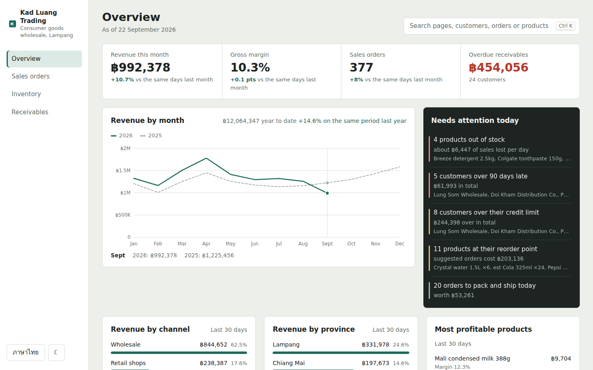
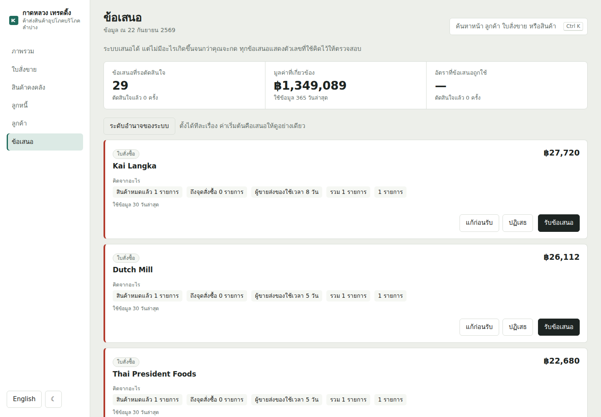
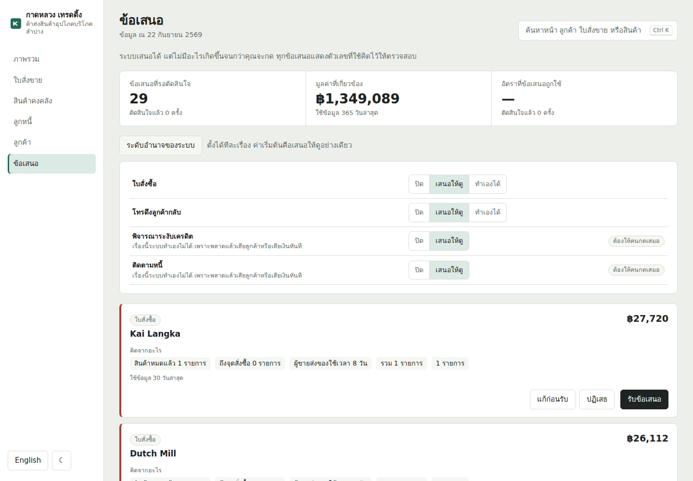
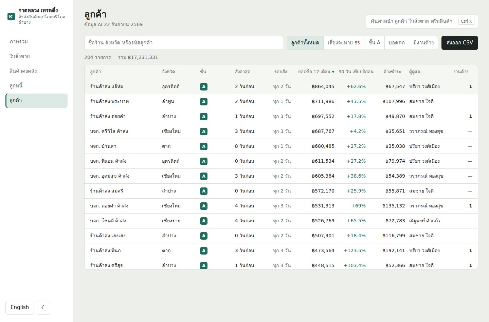
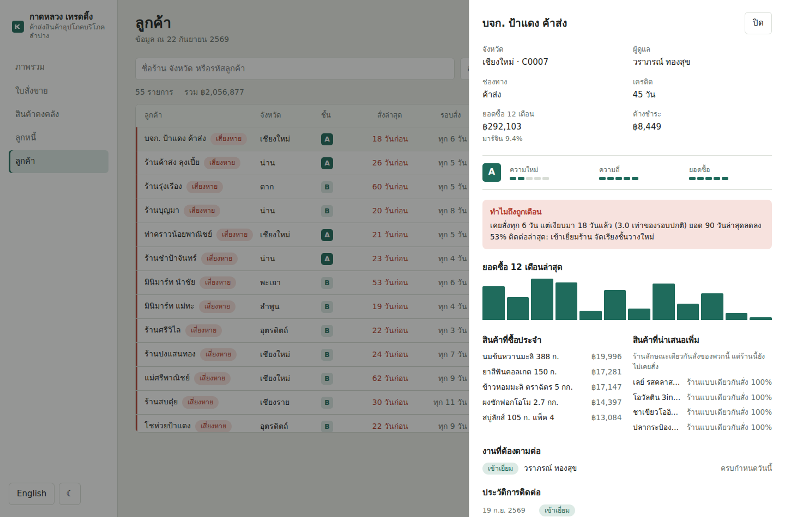
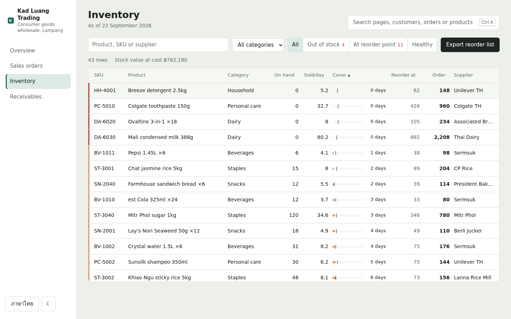
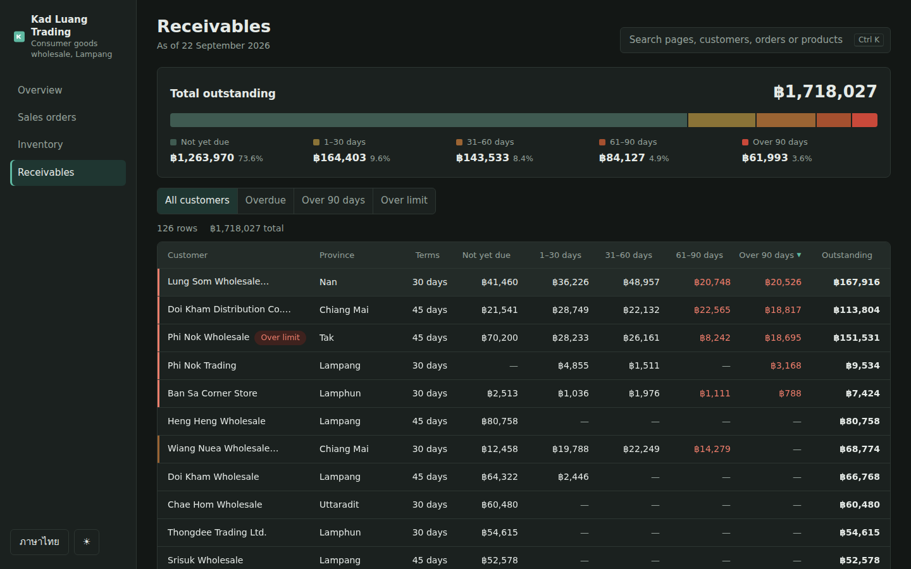
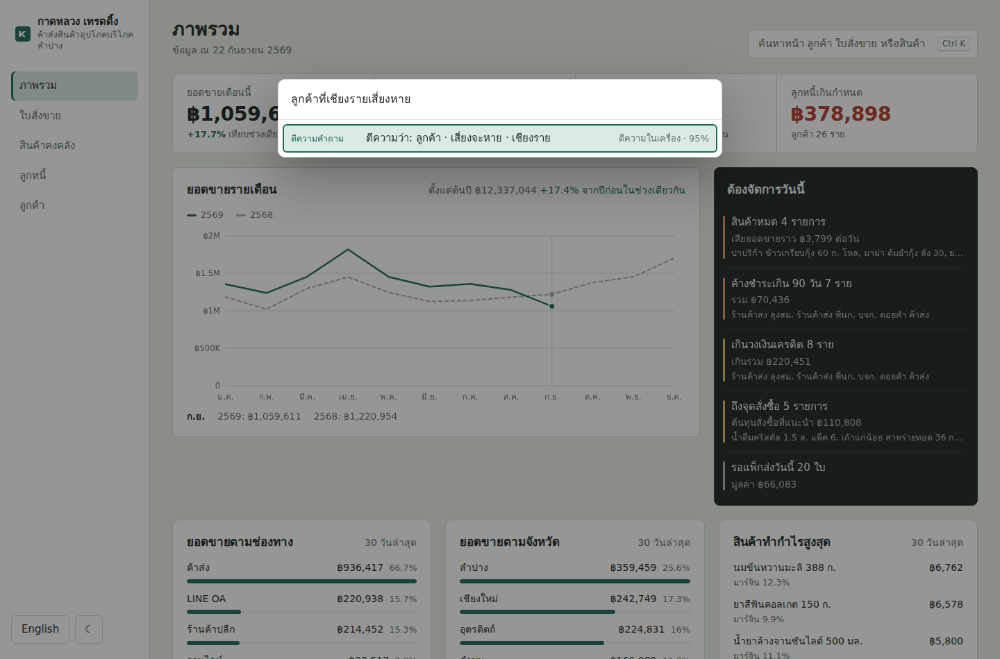
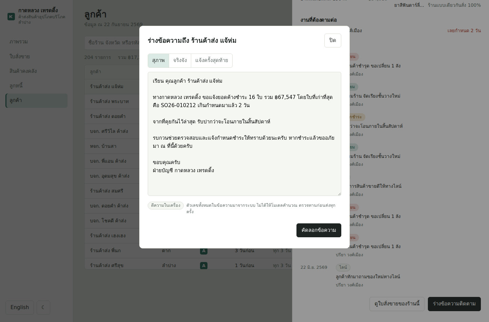
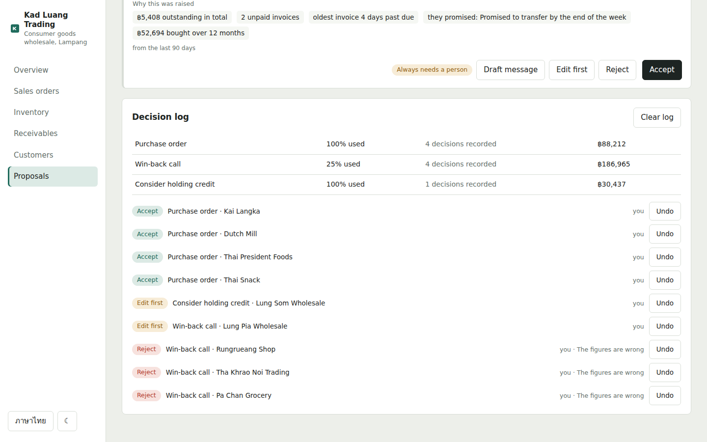

# Kad Luang Trading — ERP and CRM dashboard

Operations, money and relationships for a consumer-goods wholesaler in Lampang, northern Thailand. The ERP side answers *what needs dealing with today*; the CRM side answers *which shops are quietly slipping away*.

**Live demo:** https://ihatepython1.github.io/erp-dashboard/

The system proposes; the owner decides. Suggestions carry the figures behind them, two kinds of action can never be automated at all, and every decision is recorded so the rules can be judged on how often they were accepted.

React 19 and strict TypeScript, built with Vite. No UI kit, no chart library, no state library: the data grid, the charts, the drawer, the command palette and the question reader are all written for this project. Thai and English throughout, with Buddhist-era dates in Thai.



## Pages

**Sales analysis.** Compare a selected month with the previous month or the same month last year, or select two custom date ranges. Incomplete months use matching day numbers. Revenue, gross profit, bills and average bill value reconcile with contribution tables by product, category, sales channel, customer group and customer. SKU-level quantity and average-price effects explain the arithmetic behind changes; they do not establish causation. Export the comparison to CSV. A monthly product heatmap switches between revenue, units and gross profit, using either absolute totals or each product's average across complete months in the selected year. Select a cell for its totals and twelve-month history. Partial months and missing history are labelled. Summaries are deterministic and do not require an AI API key.

**Overview.** Revenue, gross margin, order count and overdue receivables for the month, each against the same span of days last month. Revenue by month against the previous year, and breakdowns by channel, province and product. Next to them, the one dark panel on the page: what needs attention today — stockouts, customers over 90 days late or over their credit limit, lines at their reorder point, orders still to ship. Every item links to a filtered list.

**Sales orders.** Around ten thousand orders in a grid that stays smooth because only the visible rows exist in the DOM. Filter, search, sort, and open an order for its lines, cost and gross profit.

**Inventory.** Days of stock cover at the current selling rate, drawn against a tick marking the supplier's lead time: a bar that ends before the tick is a stockout on its way. Reorder points, suggested quantities rounded to whole cartons, and a reorder list that exports grouped by supplier.

**Receivables.** An ageing bar for the whole ledger, then every customer's debt split across the buckets, worst first, with their unpaid invoices one click away.

**Proposals.** Everything the system thinks is worth doing today — reorder suggestions grouped into one purchase order per supplier, win-back calls, accounts bad enough to consider holding credit on, and debts young enough to chase politely. Each card carries the figures it was derived from and three answers: accept, edit first, or reject with a reason.

**Customers (CRM).** RFM scoring into A/B/C tiers, each shop's own ordering rhythm, and a churn flag raised when an account has been quiet for more than twice its own normal gap. Twelve months of purchases, the lines they buy regularly, lines their peers buy that they do not, contact history, and open follow-ups.

| | |
|---|---|
|  |  |
|  |  |
|  |  |

### Why the CRM is not a sales pipeline

Wholesale customers are regular shops reordering every few days, not deals that close once a year. A Salesforce-shaped pipeline would describe the wrong business. What matters here is rhythm: a shop that ordered every four days and has been silent for twenty is worth a phone call today, and that is what the churn flag measures — each account against its own history, not against an average.

## Where AI fits, and where it deliberately does not

The rule that shapes all of it: **the model never produces a number.** Forecasting, reorder points, ageing and churn are arithmetic, and arithmetic belongs in tested functions. A language model asked to do sums is the most efficient way to make a dashboard lie to its owner.

So the model gets two jobs, both of which play to what it is actually good at.

### 1. Reading a question into a view



Type *"ลูกค้าที่เชียงรายเสี่ยงหาย"* into the command palette and press Enter; you land on `#/customers?risk=1&prov=Chiang+Rai`. The model is asked for an **intent** and nothing else:

```json
{ "route": "/customers", "params": { "risk": "1", "prov": "Chiang Rai" } }
```

Every figure on the page that follows is computed by the same tested selectors as always. A misreading is visible — the filters on screen say what it understood, in the same words the filter buttons use — and correctable by hand.

**It works with no model at all.** `src/ai/parse.ts` is a rule engine that reads the same questions in Thai and English offline. That is what runs on GitHub Pages, what runs when the API is down, and what the model is measured against.

### 2. Drafting a follow-up message



Open a customer who owes money and draft a message for LINE in three tones. The facts — how many invoices, the total, the oldest invoice number, how many days late, what they last promised — are pulled from the ledger and **formatted into strings before the model sees them**. The model rewrites wording; it cannot invent a figure, because it is never handed a raw one. Offline, a template does the same job, and the dialog says which wrote it.

The backend checks the result and throws the draft away if the figures went missing, falling back to the template.

### 3. Proposing, never acting


A suggestion is only useful if the person reading it can tell whether to trust it, so every proposal shows **the numbers it came from** rather than a sentence describing them: *quiet for 18 days · used to order every 6 days · ฿292,103 bought over 12 months · −53.4% against the same period last year*. Three answers are always available — accept, edit first, reject with a reason.

**How much it may do alone is set per kind**, and starts at suggest-only for everything. At *act alone*, a limit applies: purchase orders under ฿5,000 can go through unattended, larger ones wait for a person.

**Two kinds can never act alone, whatever the settings say.** Holding a customer's credit and sending them a message are locked in `src/lib/decisions.ts`, because a mistake there loses the account on the spot and automating it saves one click. The lock is enforced in four places and tested: the UI never offers the option, `clampLevel` rejects it, settings are clamped when read from storage, and `autoApplicable` filters locked kinds out regardless. A settings value edited by hand in localStorage still cannot unlock it.

### Measuring whether the proposals were any good



Every decision is recorded: which proposal, what was chosen, by a person or automatically, and the reason for a rejection. That gives an acceptance rate per kind — and a rule that keeps being rejected is a **wrong threshold, not a wording problem**. `needsReview` flags it once there are enough decisions to say so, and the settings panel says exactly that.

Accepted and edited are counted separately: a proposal that was worth having but needed adjusting is still a useful proposal, and the two rates say different things about the rule.

### Deliberately not done with a model

Churn detection, reorder suggestions, RFM tiers, and the peer comparison behind "worth offering" are all plain arithmetic in `src/data/crmSelectors.ts`. They are cheaper, faster, explainable, and covered by tests. The risk explanation shown on a flagged account is assembled from the numbers that raised the flag rather than written by a model.

### Evaluation, not vibes

`tests/ai.test.ts` is an evaluation set: 36 real questions in Thai and English, each labelled with the view that answers it. It reports accuracy and fails below 90%. The offline rule engine currently reads **36 of 36**.

Six of those cases are questions the reader **must refuse** — *"สวัสดีครับ"*, *"พรุ่งนี้ฝนจะตกไหม"*, *"delete all the data"*. A confident wrong filter is worse than an honest "I did not understand that", so declining is tested as its own requirement. Swapping `read` in that file for a model-backed parser runs the same set against the model, which is how the two would be compared before trusting either in production.

### Untrusted by default

Model output is validated twice, on both sides of the wire:

- The browser (`isValidIntent`) rejects unknown routes, odd parameter names and oversized values.
- The backend (`cleanIntent`) independently drops filters that belong to another page, values outside the vocabulary, and unknown routes, and clamps a made-up confidence.

Both are tested, including `__proto__` and path-shaped routes.

### Running the AI backend

The browser never holds an API key. `ai-backend/server.mjs` does — a zero-dependency Node server exposing `/api/ai/health`, `/api/ai/intent` and `/api/ai/draft`:

```bash
ANTHROPIC_API_KEY=sk-... node ai-backend/server.mjs   # port 8787
npm run dev                                            # Vite proxies /api to it
```

With no key it answers 503 on the model endpoints and the app quietly uses its offline logic, which is exactly what the deployed demo does.

## The data grid

`src/components/DataGrid.tsx` is a generic typed component used by all four list pages.

- **Virtualized.** Rows are absolutely positioned inside a spacer as tall as the full list; only the rows in view plus a small overscan are rendered. The window arithmetic is a pure function, `visibleRange`, tested without a browser.
- **Keyboard first**, following the ARIA grid pattern: focus stays on the grid, the active row is announced through `aria-activedescendant`, and arrow keys, Page Up/Down, Home/End and Enter all work.
- **Sorting** through `aria-sort` headers. Numbers open largest first, empty values sort last either way, ties keep their order, codes sort naturally, and Thai sorts by Thai collation.

## The sample data

Generated in the browser from a fixed seed, so the demo, the screenshots and the tests always agree. It is built to behave like a distributor rather than random noise:

- 43 real products, 204 customers across ten northern provinces, weighted toward Lampang
- Songkran, Loy Krathong and year-end lift sales; the rainy season dips; roughly 13% annual growth
- Wholesale buys cartons on 30–45 day terms, shops buy packs on 15–30, online pays up front
- Shops move their ordering onto the company's LINE OA over time: about 5% of revenue in early 2025, around 17% now
- **Every account has its own trajectory** — some growing, some fading, a few that stop buying altogether. Without that, per-customer trends are Poisson noise and a churn report has nothing real to find
- Credit limits are derived from each account's own purchase history, the way a credit controller sets them
- About one customer in ten pays weeks or months late, which is what gives the ageing report something to show

Year-on-year is used for the customer trend rather than the previous quarter. Comparing the rainy season against Songkran makes every account look like it is collapsing — a seasonality artefact, not a business signal.

## Tests

111 tests on Vitest and Testing Library.

```bash
npm test
```

- **Data rules:** order totals equal their lines; nothing is paid before it is ordered; ageing buckets reconcile per customer and against the overview; suggested orders are whole cartons covering lead time plus target; healthy stock is never reordered; customer names are unique in both languages
- **CRM:** RFM scores stay within range and are monotonic in spend and recency; tiers split the book; churn is only raised for established accounts genuinely off their rhythm; a customer ordering on time is never flagged; every contact and task points at a real customer and the rep who covers their province; the biggest debtors all have a collection task
- **Proposals:** a purchase order's amount equals its lines at cost; win-backs only target accounts the CRM already flags; credit holds only target genuinely bad debt; chasing and holding are never proposed for the same account at once; proposal ids are stable so a decision stays attached
- **Guardrails:** locked kinds are never offered, never clamped upward, never unlocked by tampered storage and never auto-applied; automatic application respects the limit, is idempotent, and never overwrites a decision a person made
- **Measurement:** acceptance and useful rates, value excluding rejections, and the review flag that fires only with enough evidence
- **Drafting:** the facts match the ledger, the message repeats those figures and contains no others, tone changes the ending and not the numbers
- **AI:** the labelled evaluation set, the refusals, page/filter consistency, and validation of model output on both sides
- **Utilities:** the virtual window stays small for a million rows, stable sorting with empties last, CSV quoting, hash routing
- **Translations:** every key exists in both languages and `{placeholders}` match, so a missing English string fails the build rather than showing a blank label
- **Component:** the grid renders a window of 10,000 rows, moves it on scroll, sorts, and handles the keyboard

The suite has caught real bugs, including a customer-name generator colliding constantly because it drew with replacement (the birthday problem: 150 draws from 240 combinations collide about 38 times), and a breadth-first search that was not breadth-first.

## Running it

```bash
npm install
npm run dev        # http://localhost:5173
npm test
npm run build
```

## Deploying

Pushing to `main` runs `.github/workflows/deploy.yml`: typecheck, tests, build, publish to GitHub Pages. A failing test stops the deploy; pull requests are tested but not published.

One-time setup: **Settings → Pages → Build and deployment → Source: GitHub Actions.**

Routing uses the URL hash and Vite builds with relative asset paths, so the site works from any repository name with no server configuration. The AI backend is optional and deploys separately wherever Node runs.

## Project layout

```
src/
  data/        types, seeded generator, ERP selectors, CRM metrics, proposal rules
  ai/          question parser (offline) and the model client
  lib/         day arithmetic, i18n and formatting, router, sorting, CSV, autonomy and the decision log
  components/  DataGrid, charts, drawer, command palette, draft dialog
  pages/       Overview, Orders, Inventory, Receivables, Customers, Proposals
ai-backend/    optional zero-dependency proxy that holds the API key
tests/         data rules, CRM, AI evaluation, utilities, grid behaviour
```

## ภาษาไทย

แดชบอร์ด ERP และ CRM ของบริษัทค้าส่งสินค้าอุปโภคบริโภคสมมุติในลำปาง มีห้าหน้า คือ ภาพรวม ใบสั่งขาย สินค้าคงคลัง ลูกหนี้ และลูกค้า เขียนด้วย React + TypeScript โดยไม่ใช้ UI library หรือ chart library

หน้า "ข้อเสนอ" ทำงานบนหลักว่าระบบเสนอได้แต่คนเป็นคนตัดสินใจ ทุกข้อเสนอแสดงตัวเลขที่ใช้คิดให้ตรวจสอบได้ ตั้งระดับอำนาจได้ทีละเรื่อง และมีสองเรื่องที่ระบบทำเองไม่ได้เด็ดขาดคือระงับเครดิตกับส่งข้อความหาลูกค้า ทุกการตัดสินใจถูกบันทึกไว้เพื่อวัดว่าเกณฑ์ไหนถูกใช้จริงกี่เปอร์เซ็นต์

ฝั่ง AI ยึดหลักเดียวคือ **ไม่ให้โมเดลคำนวณตัวเลข** โมเดลทำสองอย่างเท่านั้น คือแปลคำถามภาษาไทยเป็นตัวกรอง (เช่น "ลูกค้าที่เชียงรายเสี่ยงหาย" กลายเป็นหน้าลูกค้าที่กรองไว้แล้ว) และเรียบเรียงข้อความติดตามหนี้จากข้อเท็จจริงที่คำนวณและจัดรูปแบบเสร็จแล้ว ทุกฟีเจอร์ทำงานได้เต็มรูปแบบโดยไม่ต้องมี API key เพราะมีตัวตีความในเครื่องเป็นค่าเริ่มต้น และมีชุดวัดผล 36 คำถามที่วัดความแม่นยำ พร้อมคำถามที่ระบบต้องปฏิเสธแทนการเดา

## License

MIT
