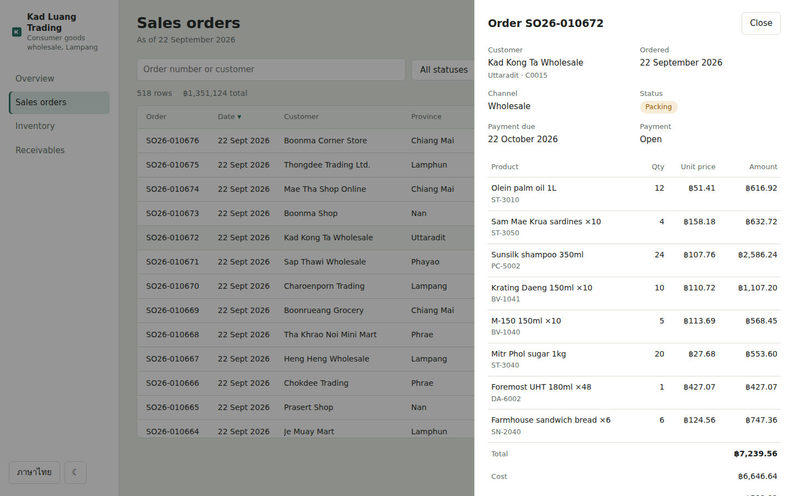
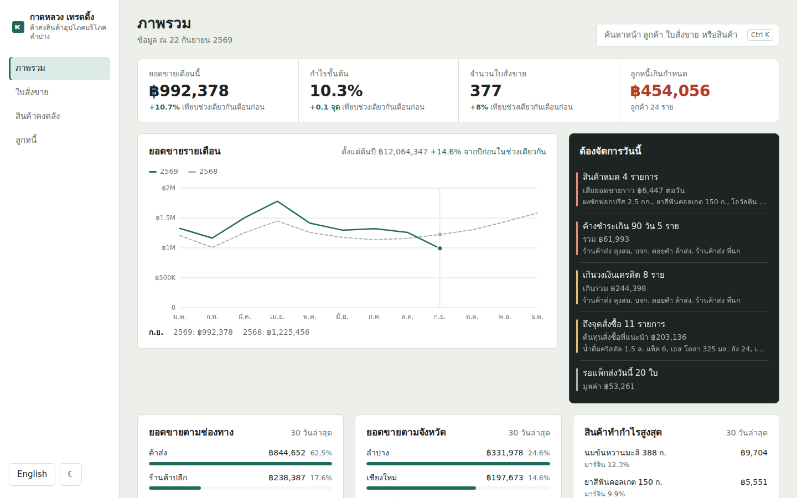

# Kad Luang Trading — ERP dashboard

An operations dashboard for a consumer-goods wholesaler in Lampang, northern Thailand: sales orders, stock, and money owed, built around the question an owner asks every morning — *what needs dealing with today?*

**Live demo:** https://ihatepython1.github.io/erp-dashboard/

React 19 and strict TypeScript, built with Vite. No UI kit and no chart library: the data grid, the charts, the drawer and the command palette are written for this project. Thai and English throughout.


## What it does

**Overview.** This month's revenue, gross margin, order count and overdue receivables, each against the same span of days last month. Revenue by month compared with the previous year. Breakdowns by sales channel, province and most profitable product. Beside them, the one dark panel on the page: a queue of what needs attention — products out of stock, customers more than 90 days late or over their credit limit, products at their reorder point, and today's orders still to ship. Every item links straight to a filtered list.

**Sales orders.** About ten thousand orders in a grid that stays smooth because only the visible rows exist in the DOM. Filter by status, channel and date range; search by order number or customer; sort any column; open an order to see its lines, cost and gross profit. Filters live in the URL, so any view can be bookmarked or shared.

**Inventory.** Days of stock cover at the current selling rate, drawn against a tick marking the supplier's lead time — a bar that ends before the tick is a stockout on its way. Reorder points and suggested order quantities rounded to whole cartons, with a reorder list that exports to CSV grouped by supplier.

**Receivables.** An ageing bar for the whole ledger (not yet due, 1–30, 31–60, 61–90, over 90 days), then every customer's debt split across those buckets, worst first. Open a customer to see each unpaid invoice.

Also: a command palette on <kbd>Ctrl</kbd>+<kbd>K</kbd> (or <kbd>/</kbd>) that searches pages, customers, products and orders; dark mode; CSV exports that open correctly in Excel with Thai text; dates in the Buddhist-era calendar in Thai (22 กันยายน 2569) and the Gregorian one in English.

| | |
|---|---|
|  |  |
|  |  |

## The data grid

`src/components/DataGrid.tsx` is a generic, typed component used by all three list pages.

- **Virtualized.** Rows are absolutely positioned inside a spacer as tall as the full list; only the rows in view plus a small overscan are rendered. The window arithmetic lives in a pure function, `visibleRange`, so it is tested without a browser.
- **Keyboard first**, following the ARIA grid pattern: focus stays on the grid and the active row is announced through `aria-activedescendant`. Arrow keys, Page Up/Down, Home/End, and Enter to open. The active row is scrolled into view when needed and left alone when it already is.
- **Sorting** through `aria-sort` headers. Numbers open largest first, text A to Z. Empty values sort last in either direction, ties keep their order, codes sort naturally (`SO26-000009` before `SO26-000010`), and Thai sorts by Thai collation rather than code point.

## The sample data

Everything is generated in the browser from a fixed seed (`src/data/generate.ts`), so the demo, the screenshots and the tests always agree. It is built to behave like a real distributor rather than random noise:

- 43 real products across six categories, 204 customers across ten northern provinces, weighted toward Lampang
- Seasonality: Songkran in April, Loy Krathong and year-end lift sales, the rainy season dips; about 13% growth a year
- Wholesale accounts buy whole cartons on 30 or 45 days' credit; shops buy a few packs on 15 or 30 days; online orders are paid up front
- Shops move their ordering onto the company's LINE OA over time — about 5% of revenue at the start of 2025, close to 18% now
- Most customers pay near their due date; about one in ten drifts weeks or months late, which is what gives the ageing report something to show
- Credit limits are set from each account's purchase history — about one and a half terms' worth — the way a credit controller would set them
- Costs rise a little faster than prices, so margins are under gentle pressure, as they usually are

## Tests

50 tests with Vitest and Testing Library.

```bash
npm test
```

- **Data rules:** order totals equal the sum of their lines; nothing is paid before it is ordered; cancelled orders are never paid; ageing buckets add up per customer and in total, and match outstanding on the overview; suggested orders are whole cartons and cover lead time plus the target; healthy stock is never suggested for reorder; customer names are unique in both languages
- **Utilities:** the virtual window never renders past either end and stays small for a million rows; sorting is stable with empty values last; CSV quoting; hash routing
- **Translations:** every key exists in both languages, and `{placeholders}` match between them, so a missing English string is a failing test rather than a blank label on screen
- **Component:** the grid renders a small window of 10,000 rows, moves the window on scroll, sorts and announces direction, and supports arrow keys, End and Enter

The tests found real problems while this was being built. One was in the generator: customer names were picked at random with replacement, and 150 draws from 240 name combinations collide about 38 times (the birthday problem). Names are now drawn without replacement.

## Running it

```bash
npm install
npm run dev        # http://localhost:5173
npm test
npm run build      # production build in dist/
```

## Deploying

Pushing to `main` runs `.github/workflows/deploy.yml`: typecheck, tests, build, then publish to GitHub Pages. A failing test stops the deploy. Pull requests are tested but not published.

One-time setup: **Settings → Pages → Build and deployment → Source: GitHub Actions.**

Routing uses the URL hash (`#/orders?status=packing`) and Vite builds with relative asset paths, so the site works from any repository name with no server configuration.

## Project layout

```
src/
  data/        types, seeded generator, pure selectors (every number on screen)
  lib/         day arithmetic, i18n and formatting, router, sorting, CSV
  components/  DataGrid, charts, drawer and command palette
  pages/       Overview, Orders, Inventory, Receivables
tests/         data rules, utilities, translations, grid behaviour
```

## ภาษาไทย

แดชบอร์ด ERP ของบริษัทค้าส่งสินค้าอุปโภคบริโภคสมมุติในลำปาง มีหน้าภาพรวม ใบสั่งขาย สินค้าคงคลัง และลูกหนี้ เขียนด้วย React + TypeScript โดยไม่ใช้ UI library หรือ chart library ตาราง กราฟ และ command palette เขียนขึ้นเองทั้งหมด สลับภาษาไทย/อังกฤษได้ และแสดงวันที่เป็นปี พ.ศ. ในโหมดภาษาไทย ข้อมูลตัวอย่างสร้างจาก seed คงที่ จึงได้ผลเหมือนเดิมทุกครั้ง และจำลองพฤติกรรมธุรกิจจริง ทั้งฤดูกาลขาย ลูกค้าที่จ่ายช้า และร้านค้าที่หันมาสั่งของผ่าน LINE OA มากขึ้น

## License

MIT
